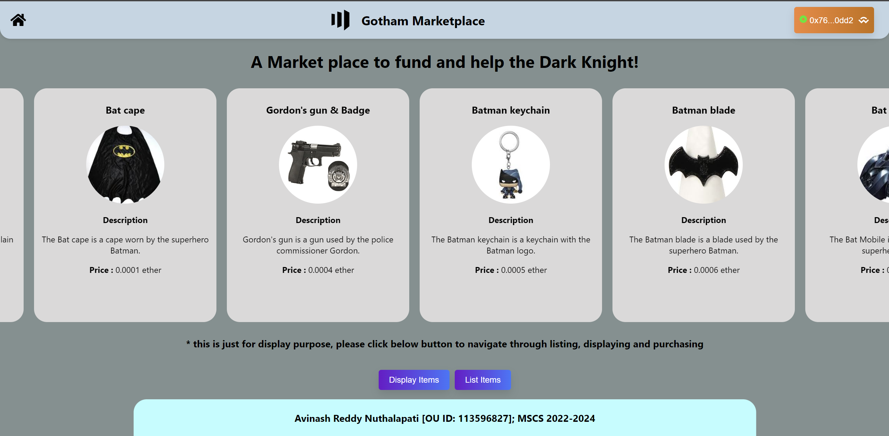
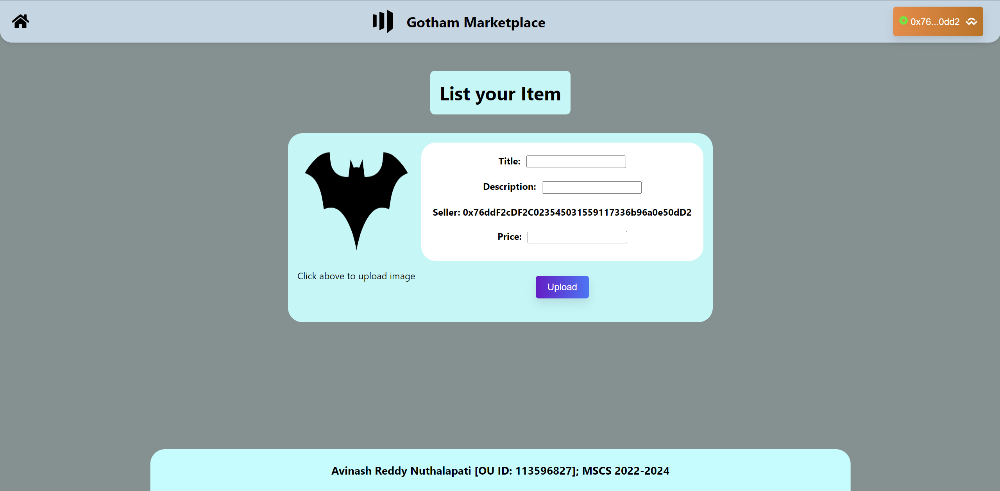
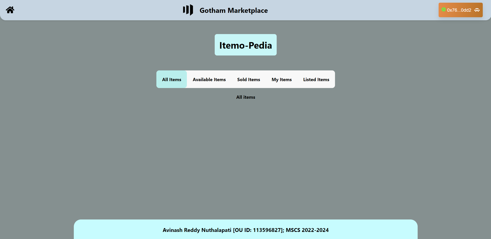

# Introduction

This project is a website built to act as an intermediatery between people such that each individual person can list items in exhcnage for ***Sepolia Ethers***
or purchase items listed by other with those test coins.

This is how it looks:



The result of my learning is the ***"Gotham MarketPlace"***. This is a market place where people can buy or sell items at some price.


# SetUp

To start working with this project, we need to have an initial setup of ***MetaMask*** wallet, ***Node.js*** and project.

### Wallet Setup:

1) Install [***MetaMask***](https://metamask.io/) extension to the browser you wish to use.

2) Create a wallet in the extension, go through all the steps and safe gaurd the security phrases.

3) Now, search for any faucets which provide ***Sepolia*** test coins and add few to your wallet.

Your wallet setup is completed.

### Node JS

1) Install [***Node JS***](https://nodejs.org/en) and go through the setup wizard.

2) Once completed with setup wizard, open terminal/Command line and run following command to check ***Node JS*** presence.


``` sh
node -v
```


3) If this gives you a version, then ***Node JS*** is installed successfully.

### Project setup

1) Clone this [***repository***](https://github.com/avinash-542/GothamMarketplace) into your machine.

2) Once cloning successfully, open command line into the repo folder.

3) run the below commands one-by-one to setup dependencies of project.

```code
npm init

npm install @openzeppelin/contracts

npm install react-router-dom

npm install web3
```

4) Then go to [***Firebase***](https://console.firebase.google.com/) and create a project, go through the steps mentioned while creating a project their.

5) Setup ***Firebase Storage*** as we will use this to store media files from our web app.

6) In Command line, run the following commands to initialize the firebase:

```code
npm install firebase

firebase login

firebase init
```

7) This is a React JS project, so remember to choose option based on this.

Mow the project setup is also complete.

# Testing

To test the installed project, run ```npm start``` command from the location inside project folder in command line. This will start the project locally. With this we can test the project, make changes to the project and then finally can deploy if we want.

If we wanted to change the features related to transations, we need to write a new [***Solidity***](https://soliditylang.org/) smart contract, compile it in [***Remix IDE***](https://remix.ethereum.org/) to get ABI data (JSON) and then deploy it to get contract address which need to be replaced or placed in filed where we want to interact with the contract and call functions there.

# Outputs

Below are some of the output screens:

### Home screen:


### Listing Screen:


### Display Screen:


# Features

1) In this project, we can list an item including image and when listed successfully, a pop up appears to show transaction details.

2) When these details are shown, there will also be a hyperlink which opens in a new window and shows block data from [***Etherscans***](https://sepolia.etherscan.io).

3) The same is with the purchasing function, a popup appears as the purchase completes and give block details.

4) In display scree, we have a total of 5 tabs named All, Available, Sold, My and Listed.

    ***All***: Here all the items listed by every user can be seen and differentiated based on category and can be seen at the bottom of item card.

    ***Available***: Here, All items available for the user to purchase are displayed. Only available to buy and not listed by user.

    ***Sold***: Here, Items listed by other users which are sold are displayed along with buyer address.

    ***My***: Here, Items purchased by the user are displayed with sold status.

    ***Listed***: Here, the items listed by the user are shown with sold or available status.

### Live website:

Here is the [****Link****](https://bcccproject.web.app/) for the live website hosted. Kindly, please visit my website, use it, make purchases and listings, give feedback to help me improve.
